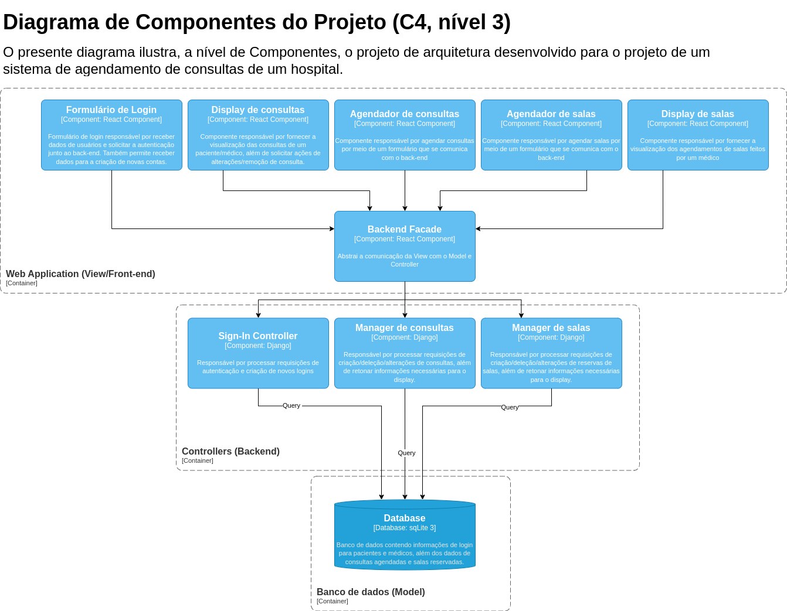

Projeto de MC426 - UNICAMP, 2 semestre de 2023

Nesse projeto iremos abordar um problema sobre Saúde Pública.

## Fazendo contribuições

Ao fazer um Pull Request (PR), é bom mantermos alguns padrões de código. Ao criar o PR, coloque antes do nome um dos seguintes prefixos:

- `chore(arquivo.txt): desc`: mudança sem nada de novo
- `feat(arquivo.txt): desc`: adicão de uma feature nova
- `fix(arquivo.txt): desc`: conserto de um bug
- `perf(arquivo.txt): desc`: mudança associada a performance

## Padrão de código em Python

Usaremos o padrão [PEP 8](https://peps.python.org/pep-0008/). Dou destaque a alguns dos padrões:

- Classes: devem ser escritar usando CamelCase. Ex: `FooBar`
- Nomes de arquivo: devem ser escritos usando snake_case. Ex: `foo_bar.py`
- Unittest: Os testes devem começar com `test` no nome do arquivo e da classe, bem como de todas as funções de teste. Ex: `test_foo_bar.py`, classe `TestFooBar`

## Arquitetura

A arquitetura Model-View-Controller (MVC) é um padrão de design amplamente utilizado no desenvolvimento de software para organizar o código de maneira a separar responsabilidades e promover a manutenibilidade. O MVC divide uma aplicação em três componentes interconectados: o Model, a View e o Controller.

Adotamos como tecnologias para o projeto Django, React e SQLite.

- Django: É um framework web em Python que segue o padrão MVT (Model-View-Template), uma variação do MVC. Django cuida da maior parte da funcionalidade do Controller por meio do roteamento de URLs e das funções de visualização.

- SQLite: É um sistema leve de gerenciamento de banco de dados relacional frequentemente utilizado com Django. No contexto dos modelos do Django, o SQLite serve como o banco de dados para armazenar e recuperar dados. O Django abstrai a interação com o banco de dados por meio de seu sistema de Mapeamento Objeto-Relacional (ORM), permitindo que os desenvolvedores interajam com o banco de dados usando código Python.

- React: É uma biblioteca JavaScript para construção de interfaces de usuário, focada na criação de componentes reutilizáveis e no gerenciamento eficiente do estado da aplicação.

No contexto do nosso projeto, separamos os componentes em:

- Model (Django e SQLite): O Model representa a estrutura dos dados e a lógica de negócios da aplicação. Em Django e SQLite, o Model é geralmente expresso por meio de classes Python. Estas classes definem a organização das tabelas no banco de dados SQLite e incorporam métodos que facilitam a consulta e manipulação dos dados.

- View (Django e React): A View é responsável por apresentar os dados ao usuário e gerenciar a lógica da interface. No contexto do framework web Django, a View está associada a templates HTML, definindo a forma como os dados são exibidos. Em React, os componentes desempenham um papel semelhante, representando a View e sendo responsáveis pela renderização da interface do usuário.

- Controller (Django e React): O Controller age como intermediário entre o Model e a View. Ele processa a entrada do usuário, atualiza o Model conforme necessário e, em seguida, reflete essas alterações na View. Em Django, essa funcionalidade é gerenciada pelo próprio framework, utilizando o roteamento de URLs e funções de visualização. Em React, a lógica de controle é distribuída entre manipuladores de eventos e funções que atualizam o estado, promovendo uma abordagem mais descentralizada.

Em resumo, a arquitetura MVC/MVT, quando implementada no Django com SQLite, proporciona uma abordagem estruturada e modular para o desenvolvimento de aplicações web. O Model lida com dados e lógica de negócios, a View trata da apresentação e o Controller (parcialmente gerenciado pelo Django) coordena o fluxo de dados entre o Model e a View. O SQLite atua como o banco de dados subjacente, integrado de maneira eficiente ao ORM do Django para gerenciamento de dados.

O padrão de design que escolhemos foi a Facade. No contexto do nosso projeto, criamos o Manager da Database, que atua como um ponto de entrada único para acessar e manipular dados no banco. Isso significa que, em vez de lidar diretamente com as complexidades do banco de dados, os usuários interagem apenas com a Facade, que encapsula os detalhes de implementação.

No desenvolvimento de um gerenciador de banco de dados utilizando o padrão de Facade, estamos criando uma camada de abstração que simplifica a comunicação com o SQLite. A Facade oferece métodos e operações coerentes que ocultam a complexidade interna do sistema de banco de dados, proporcionando uma experiência mais intuitiva e facilitando a manutenção do código.