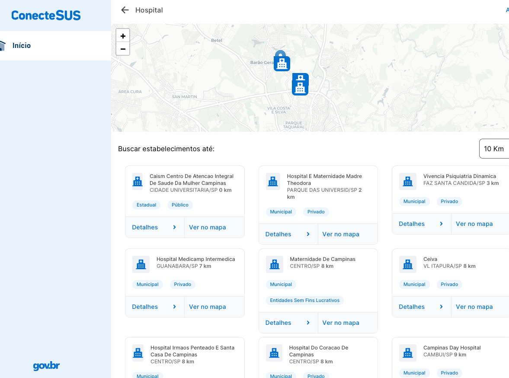
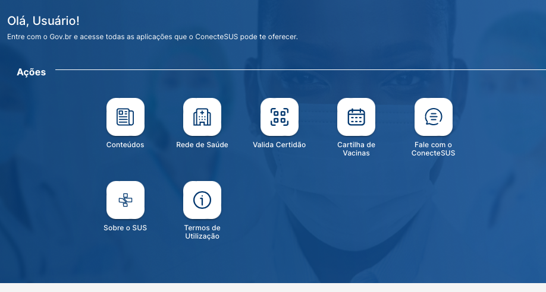

Para iniciar a elicitação de requisitos, primeiramente utilizamos da entrevista com 2 médicos formados na UNICAMP. Segue o formulário a ser preenchido e as duas respostas. Posteriormente, utilizamos das técnica de benchmarking e brainstorming.

# Entrevistas

O obejtivo das entrevistas foi apenas fazer um mapeamento sobre a rotina de um médico, como são feitos os agendamentos, como os pacientes são direcionados, etc. e entender quais são as principais dificuldades que ele enfrenta no dia a dia. A partir disso, foi possível identificar alguns requisitos que podem ser implementados no sistema. Os principais estão ligados a burocracia dos sistemas utilizados, da curva de aprendizado da tecnologia.

Outro ponto levantado foi a disponibilização de dados de pacientes como por exemplo laudos de exames, porém não será possível implementar, pois demandaria muito esforço para entrar nos conformes da LGPD.

**Roteiro das entrevistas:**

Bom dia. Estamos desenvolvendo um sistema de gerenciamento médico e gostaríamos de ouvir sua opinião como profissional da área de saúde. Você pode responder por áudio ou por escrito. Obrigado pela sua colaboração!

1. Qual seu nome e profissão?
2. Em qual ambiente médico você já trabalhou? Clínicas, hospitais, laboratórios…
3. Quais as principais tarefas de gerenciamento ou documentação que você realiza no seu dia a dia? Poderia explicar como é feito esse processo?
4. Que tipos de informações ou dados clínicos você considera essenciais para um sistema de gerenciamento hospitalar?
5. Quais recursos ou funcionalidades em um sistema de gerenciamento hospitalar você acredita que poderiam melhorar a eficiência do seu trabalho?
6. Na sua experiência médica, quão comum é um paciente ter que ser realocado entre especialidades? Que tipo de informação ou funcionalidade você acredita que poderia ser fornecida para evitar essa realocação?
7. Que funcionalidades você gostaria de ver para melhorar o agendamento de consultas e a alocação de recursos, como salas de cirurgia ou leitos?
8. Existe algum tipo de dúvida frequente dos pacientes que você acha que poderia ser melhor respondida ou abordada por meio de um sistema de gerenciamento médico?
9. Algo a mais que deseje acrescentar?

## Respostas a entrevista:

### Primeira resposta:

**1. Qual seu nome e profissão?**

Carolina Marques Lopes Nourani 
Oncologista Clínica 

**2. Em qual ambiente médico você já trabalhou? Clínicas, hospitais, laboratórios...**

Hospitais e clínicas. 

**3. Quais as principais tarefas de gerenciamento ou documentação que você realiza no seu dia a dia? Poderia explicar como é feito esse processo?**

Atualmente sou funcionária  pública em um hospital municipal. O hospital não dispõe de prontuário eletrônico, é tudo manual. Desde registro de consulta até laudo de exames. 
Eu registro consulta, prescrevo as quimioterapias e solicito os exames. 
A enfermagem agenda a coleta de exames e a infusão do medicamento. 
A recepção agenda o retorno e os exames de imagem. 

**4. Que tipos de informações ou dados clínicos você considera essenciais para um sistema de gerenciamento hospitalar?**

Dados demográficos, de gênero, idade, Cid10 das doenças de base, medicamentos em uso, internações prévias 

**5. Quais recursos ou funcionalidades em um sistema de gerenciamento hospitalar você acredita que poderiam melhorar a eficiência do seu trabalho?**

No meu atual cenário, a simples informatização do sistema já faria grande diferença. 

**6. Na sua experiência médica, quão comum é um paciente ter que ser realocado entre especialidades? Que tipo de informação ou funcionalidade você acredita que poderia ser fornecida para evitar essa realocação?**

A grande maioria da população necessita de acompanhamento do generalista (seja clínico geral, ginecologista ou pediatra) e se necessário esse encaminha ao especialista. Mas culturalmente em nosso país as pessoas procuram o especialista diretamente. O ideal seria um modelo de saúde como no Canadá onde todas as pessoas possuem um médico de família e esse se necessário encaminha ao especialista. 

**7. Que funcionalidades você gostaria de ver para melhorar o agendamento de consultas e a alocação de recursos, como salas de cirurgia ou leitos?**

Essa questão de agendamento e alocação de recursos é feita muito mais pelo gestor/ administrador dos serviços (seja clínica ou hospital) do que pelo médico em si. Esses gestores seriam mais capazes de identificar essas funcionalidades do que nós médicos.

**8. Existe algum tipo de dúvida frequente dos pacientes que você acha que poderia ser melhor respondida ou abordada por meio de um sistema de gerenciamento médico?**

Na minha área, oncologia, os pacientes têm muitas dúvidas sobre o manejo de efeitos colaterais de quimioterapia. Já existem alguns centros de referência que usam aplicativos de comunicação entre pacientes e enfermeiras (pacientes reportam efeitos colaterais e são orientados pelos enfermeiros) isso reduz idas ao pronto socorro, reduz internação hospitalar e aumenta adesão ao tratamento e eficácia terapêutica.

### Segunda resposta: 

**1. Qual seu nome e profissão?**

Hugo Nourani, médico cardiologista

**2. Em qual ambiente médico você já trabalhou? Clínicas, hospitais, laboratórios...**

Clínicas e hospitais

**3. Quais as principais tarefas de gerenciamento ou documentação que você realiza no seu dia a dia? Poderia explicar como é feito esse processo?**

Clinica: diagnosticos, registro de consultas, medicamentos de uso habitual, alergias, exames anteriores, antecedentes pessoais e familiares, atestados, relatórios, receitas e pedidos de exame

**4. Que tipos de informações ou dados clínicos você considera essenciais para um sistema de gerenciamento hospitalar?**

Hospitais: todos acima acrescidos da prescrição médica, evolução, intercorrências e controles do paciente (sinais vitais ao longo do dia e registro de ocorrências e medicamentos administrados). Controle medicamentos, controles dos pacientes, exames realizados, interconsultas e avaliações, gerenciamento de leitos e faturamento.

**5. Quais recursos ou funcionalidades em um sistema de gerenciamento hospitalar você acredita que poderiam melhorar a eficiência do seu trabalho?**

Mesma resposta do último item.

**6. Na sua experiência médica, quão comum é um paciente ter que ser realocado entre especialidades? Que tipo de informação ou funcionalidade você acredita que poderia ser fornecida para evitar essa realocação?**

É comum sim, embora em geral em um hospital privado o médico responsável pela internação mantenha o mesmo o paciente pode circular por diversos setores e especialidades no hospital. Já nos hospitais públicos pode ser até mais comum pq muitos hospitais públicos nem trabalham com médico responsável pela internação (o responsável é sempre o diretor clínico ou chefe da especialidade).

**7. Que funcionalidades você gostaria de ver para melhorar o agendamento de consultas e a alocação de recursos, como salas de cirurgia ou leitos?**

Flexibilidade de agendamento com horários/durações variados para os diferentes procedimentos e tipos de consulta, possibilidade de alertas pop up quando for agendar um determinado paciente ou procedimento, possibilidade de agendamento de encaixe, possibilidade de limitar agenda para número máximo ou horário restrito de cada tipo de agendamento por dia.

**8. Existe algum tipo de dúvida frequente dos pacientes que você acha que poderia ser melhor respondida ou abordada por meio de um sistema de gerenciamento médico?**

Confirmação de agenda com alerta, dúvidas referente aos medicamentos prescritos (nome, horarios, efeitos colaterais) , acesso a laudo de exames, orientações de preparos para os exames e procedimentos (quando necessários)

# Benchmarking

A ideia com o Benchmarking foi mapear quais as principais soluções disponíveis no mercado e suas funcionalidades principais. Destacamos as seguintes soluções:

**1. Conecte-SUS**

O sistema conecte-SUS, acessível em https://conectesus-paciente.saude.gov.br/login [acesso em 01/10/23] possível uma ampla gama de funcionalidades para os pacientes, como cartilhas de vacinas, localizar hospitais próximos, e acesso aos dados de saúde de brasileiros, como por exemplo registro de vacinas tomadas.

A ampla disponibilidade de funcionalidades e o nível de integração são pontos muito positivos deste site.

Na imagem acima vemos um print de um mapa de Hospitais próximos no site do SUS. Essa funcionalidade é muito útil, pois permite a visualização das localidades e faço acesso.

O dashboard acima mostra as diversas funções disponíveis no site (print tirado em 2023-10-01).

**2. Medware**
Essa é uma das soluções líder para médicos de hospitais e clínicas. Alguns de seus benefícios são:
- Produção de laudos e prontuários médicos de forma 100% online
- Laudos personalizados
- Aplicativo para o médico ver sua agenda online
Contrapartidas:
	- Não permite interação dos pacientes. Em conversa com o Dr. Hugo Vahid ele comentou que apesar de muito usado, muitos médicos não gostam devido a usabilidade e repetitividade. Ele relatou não haver possibilidade de formulários pré-preenchidos ou do acesso a múltiplas janelas simultaneamente na última vez que usou.

**3. Doctoralia**
Plataforma para agendamento de consultas e busca de médicos.
 Permite o agendamento online de consultas, busca de profissionais em sua região, acesso a avaliações e recomendações dos profissionais, etc. De faço uso e sem fricção.

### Conclusões do Benchmarking:

Concluimos que a falta de fricção do usuário é algo buscado por todas as soluções. Destacamos a faciliade de navegação no SUS e no Doctoralia, que são de fácil uso desde a primeira vez. 

Do app Doctortalia, o sistema de avaliações e de busca na região é de grande utilidade para o usuário, e pode ser implementado no nosso sistema alguma funcionalidade similar.

# Brainstorming

`Feitas as entrevistas e o benchmarking, já temos ideias do que pode ou não ser útil implementar. Fazemos então um brainstorm para decidirmos qual será o foco do nosso projeto.`

- Objetivo da plataforma: permitir que médicos disponibilizem suas agendas para pacientes agendar consultas.
- Permitir que um usuário agende, mude de horário ou desmarque consultas, sem atrito e sem exigir demasiadas informações pessoais
- Permitir que haja notificações em caso de possível adiantamento da consulta

**Requisitos do sistema:**

- A plataforma deve permitir que um paciente agende, altere ou desmarque consultas médicas
- A plataforma deve lidar com a possibilidade de adiantar consultas
- A plataforma deve permitir que um médico acesse e cancele as consultas que tem agendadas em sua agenda.
- A plataforma deve permitir que um centro cirúrgico disponibilize aos médicos os horários disponíveis de suas salas.
- A plataforma deve permitir que o médico reserve uma sala de centro cirúrgico.